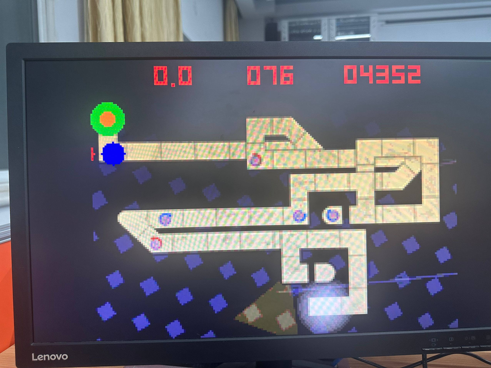

<h2 align="center"> 《永恒的东风》 之旅</h2>

<h6 align="center">Author：高华成（USTC），王昊（USTC）</h6>

<h6 align="right"><i>我们为校歌做了一款音游！</i></h6>

**这是USTC 24Fall 模拟与数字电路实验Lab8的项目展示**

#### 设备支持

*Nexys A7* 开发板，*PS2* 协议键盘，耳机或音响

#### Demo

